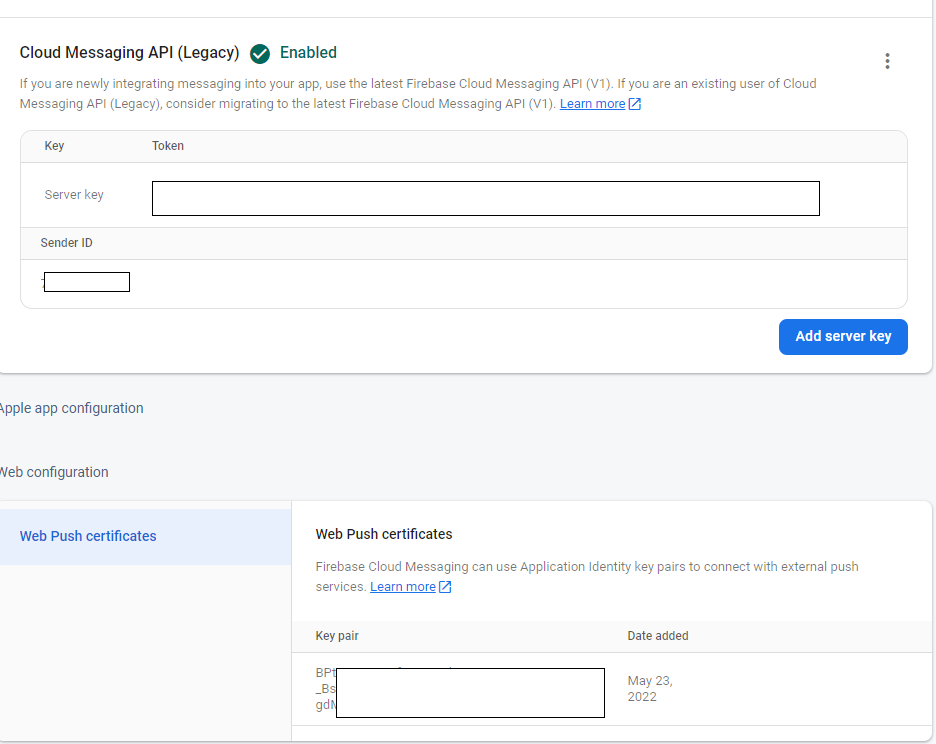

# Setup to receive firebase message in a Javascript Client
To run this project, please fill missing configuration inside:

* firebase config json (in both js file)
* vapidKey

# Steps to get firebase config json and vapidKey
## Step 1: Open firebase console in the right tab then select project settings

## Step 2: In General Tab, scroll down and get firebase config json

## Step 3: In Cloud Messaging Tab, get the server key and generate key pair (vapidKey)

# Steps to get device token after fill missing configuration
## Step 1: Instal live server

## Step 2: In index.html, press Go live and you could view running project in http://127.0.0.1:5500

## Step 2: In http://127.0.0.1:5500, press Subcribe to get device token and copy to clipboard  

